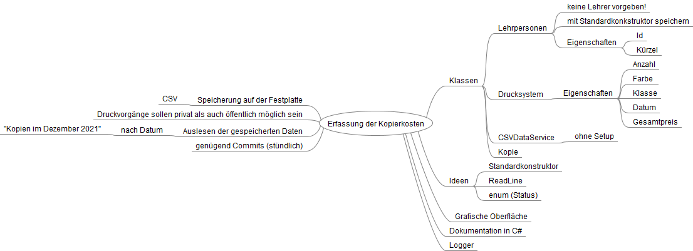
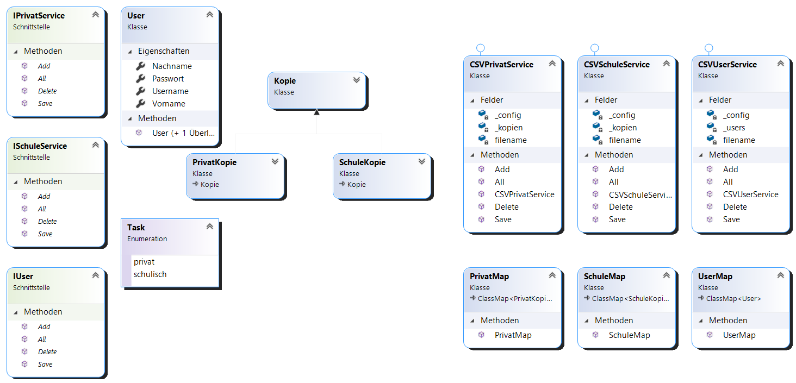

# Übung: Erfassung der Kopierkosten

:school: :dollar: :pencil:

## Ist es ein Projekt?
- [x] Ja, weil diese Aufgabe keine Routinetätigkeit beschreibt und ein fixe Abgabe vorgesehen ist
- [x] Ja, die Aufgabe hat eine Herausforderung (nicht zu leicht, nicht zu schwer)
- [x] Ja, das Erstellen dieses Programms ist ein Projekt
- [ ] Nein, das Eintragen der einzelnen Kopieraufträge nicht (Routinetätigkeit, nicht Einzigartiges!)

## Brainstorming

## Dokumenation

### Grundlegende Daten:
- Name: "maier-kilian-kopierkosten"
- Start des Projekts: 14. Dezember 2021
- Ende des Projekts: 13. Jänner 2022
- Alleinarbeit

### Klassendiagramm:

### Was kann mein Projekt?
#### Login
- mit Benutzername und Passwort

Bei der Anmeldung wird zuerst überprüft, ob es den Benutzernamen überhaupt gibt.
Im zweiten Schritt wird das Passwort gecheckt.

- Erstellung neuer Benutzer

Neue Benutzer werden der Datei hinzugefügt und können ab dem Moment des Hinzufügens,
wie normale Lehrpersonen verwendet werden

#### Erstellen neuer Kopien
- private Kopien mit Preis

- schulische Kopien

!> Die Anwendung selbst wird solange wiederholt, bis sie mit dem Buchstaben q (Quit) beendet wird.

#### Auswerten der Kopien
Die Auswertung der Kopien erfolgt immer für das gesamte Monat, dabei wird zwischen schulischen und privaten Kopien unterschieden:

?> Für schulische Kopien wird der Lehrer und die Klasse ausgegeben, für die die Kopien erstellt worden sind.

?> Für private Kopien wird der Lehrer, die Klasse ausgegeben, für die die Kopien angedacht sind und der Gesamtpreis. 

