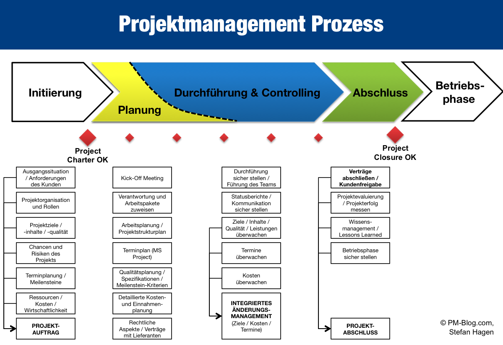

# Projektmanagement

- Ressourcen effektiv verwenden
- Ziel in möglichst guter Qualität erreichen
- keine Garantie, dass es erfolgreich wird
- wenn keines vorhanden ist, ist die Chance größer, dass das Projekt scheitert

## Softwareentwicklung

-  ist ein verwalteter Prozess

### Warum Softwareentwicklung?

- Ressource: Zeit 
- Ressource: Geld 
- Ressource: Personl 

?> Wichtige Ressourcen bleiben auch in der Programmierung gleich und sind nicht unbegrenzt!

## Projektphasen
<!-- tabs:start -->
### ** Projektinitiierung **
- Machbarkeitsstudie
- Projektvariantent: Kaffee in der Tasse/Kaffee im Becher
- Projektentscheid: für oder gegen das Projekt entscheiden)
- Kick-off (Projekt vorstellen: viele Menschen Infos übers Projekt geben), Teambildung
- Querschnittsaufgaben: Projektantrang (Rahmenbedinungen), Projektauftrag (Zieldefinition)
- gute Vereinbarung

### ** Projektplanung (Projektbeginn) **

### ** Projektdurchführung (danach -> Projektende) **
- Meilensteine können versetzt werden (haben einen Einlfuss auf das Projekt)
- Controlling
- Teamkommunikation (könnten alle gleichberechtigt sein - vielleicht keine Anrede)
- Reporting (Feedbackkultur - Wie weit sind wir? Werden die Meilensteine eingehalten?)
- Stakeholder-Analyse
- Dokumentation (Entstehung: Prozess)
- Risikomanagement
- Claim-Management (Wie werden Ziele verschoben? Werden Sie abgewiesen?)
- Projektabschlussbericht

### ** Projektevaluierung **
<!-- tabs:end -->

### Risikomanagement

- Projekt kann schiefgehen (z.B.: kann einen großen Einfluss auf das gesamte Unternehmen haben!)

!> In der Literatur findet man hinsichtlich zeitlichem Projektkontext auch die Begriffe **Vorprojektphase**, **Projekt** und **Nachprojektphase**