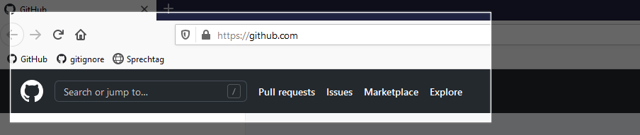
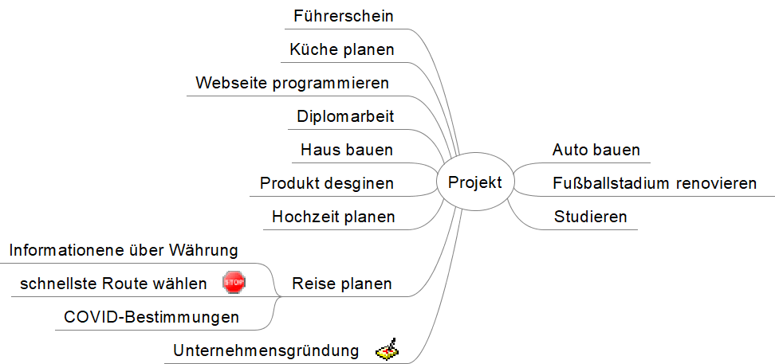

# Verwendete Tools

## Screenshots<!-- {docsify-ignore} -->
In `Windows` können Screenshots mit der Tastenkombination <kbd>Win</kbd>+<kbd>Shift</kbd>+<kbd>s</kbd> erstellt werden.

In `MacOs` können Screenhsots mit der Tasenkombination <kbd>Cmd</kbd>+<kbd>Shift</kbd>+<kbd>3</kbd> (bzw + <kbd>4</kbd> oder +
<kbd>5</kbd>) erstellt werden.

## MindMap<!-- {docsify-ignore} -->
- Eine MapMap ist eine Art Gedankenkarte mit Haupt-, Unterpunkten und Zweigen - eine Technik
- wird verwendet, um Themengebiete zu erschließen, organisieren und visuell darzustellen
- wird auch oft bei Brainstorming verwendet

## Wortwolke<!-- {docsify-ignore} -->
Wortwolken können einfach unter <https://www.wortwolken.com/> erstellt werden

## Draw.io<!-- {docsify-ignore} -->
Tool zum Erstellen von Diagrammen: <https://app.diagrams.net/>

